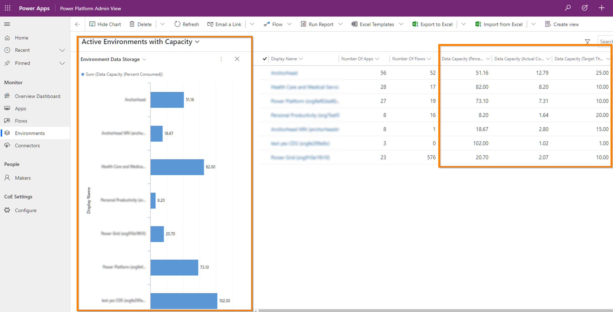

# Center of Excellence - Capacity Extension solution

## Summary

Extension to the Power Platform Center of Excellence Starter Kit. Track database storage targets and actual consumption.

- Track targets/actual on a per-environment basis
- Grid-view reporting to show environments over 80% of target
- Includes charts to show consumption.

> **Note:** This sample is one of a collection of Power Platform samples.
> [Check out the larger list here](../../README.md#Sample-Solutions).

## Deployment

### Prerequisites

- Environment with **Center of Excellence – Core Components** v1.45 or greater deployed

### Solution Deployment

- Import the solution via the Power Apps maker portal -> Solutions area
  - Either:
    - Managed: CoECapacityExtension_x_x_x_x.zip
    - Unmanaged: CoECapacityExtension_x_x_x_x.zip
- Modify the **Power Platform Admin View** app
  - Add the following Environment components
    - Form: **main form**
    - Views: all views with “capacity” in the title
    - Chart: **Environment Data Storage**
  - Deselect the original form from showing the app
    - Form: **Main Environment Form**
  - Save and publish the app

### Update data

- Log into the **Power Platform Admin View** app
- Navigate to the Environments -> **Active Environments with Capacity** view
- Export to Excel Online and set values for the Data Capacity (Target…) and Data Capacity (Actual…) fields. 
  - Note, consider using the values in the Power Platform Admin Center as a reference point.
  - Today, this is manual, however in the future when reporting APIs are available this could be automated.
- Save the data to CRM and wait for the import to refresh.
